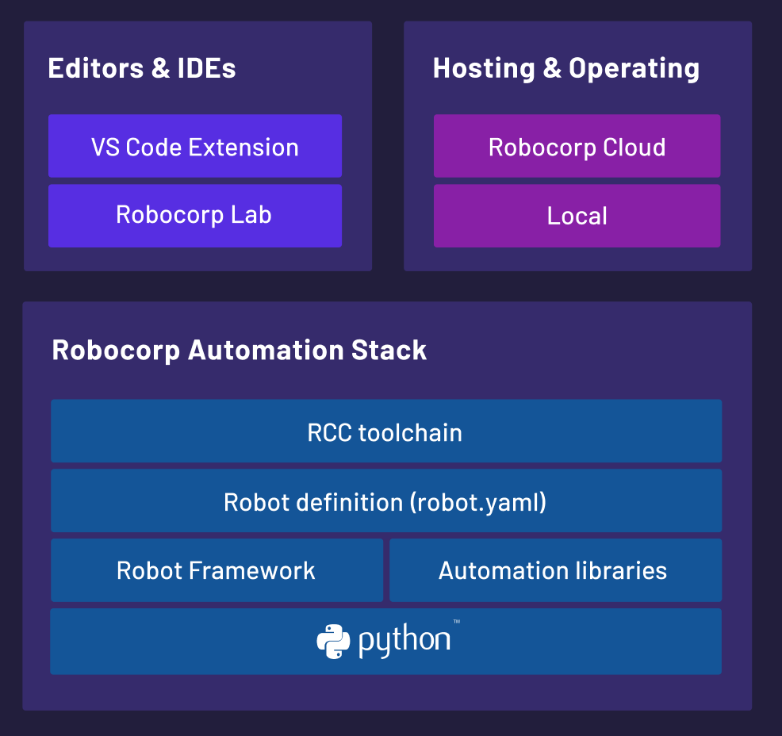

RCC is a set of tooling that allows you to create, manage, and distribute Python-based self-contained automation packages - or robots :robot: as we call them.

Together with [robot.yaml](https://robocorp.com/docs/setup/robot-yaml-format) configuration file, `rcc` is a foundation that allows anyone to build and share automation with ease.

  

## Getting Started

:arrow_double_down: Install rcc 
> [Download RCC](#direct-downloads-for-signed-executables-provided-by-robocorp)

:octocat: Pull robot from GitHub:
> `rcc pull github.com/robocorp/example-google-image-search`

:running: Run robot
> `rcc run`

:hatching_chick: Create your own robot from template
> `rcc robot initialize -t standard`

For detailed instructions, visit [Robocorp RCC documentation](https://robocorp.com/docs/product-manuals/robocorp-cli) to get started. To build `rcc` from this repository see the [Setup Guide](/docs/BUILD.md)

### Direct downloads for signed executables provided by Robocorp

| OS      | Download URL                                                     |
| ------- | ---------------------------------------------------------------- |
| Windows | https://downloads.code.robocorp.com/rcc/latest/windows64/rcc.exe |
| macOS   | https://downloads.code.robocorp.com/rcc/latest/macos64/rcc       |
| Linux   | https://downloads.code.robocorp.com/rcc/latest/linux64/rcc       |

*[EULA for pre-built distribution.](https://cdn.robocorp.com/legal/Robocorp-EULA-v1.0.pdf)*

## Documentation

Visit [https://robocorp.com/docs](https://robocorp.com/docs) to view the full documentation on the full Robocorp stack.

## Community

The Robocorp community can be found on [Developer Slack](https://robocorp-developers.slack.com), where you can ask questions, voice ideas, and share your projects.

You can also use the [Robocorp Forum](https://forum.robocorp.com)

## License

Apache 2.0