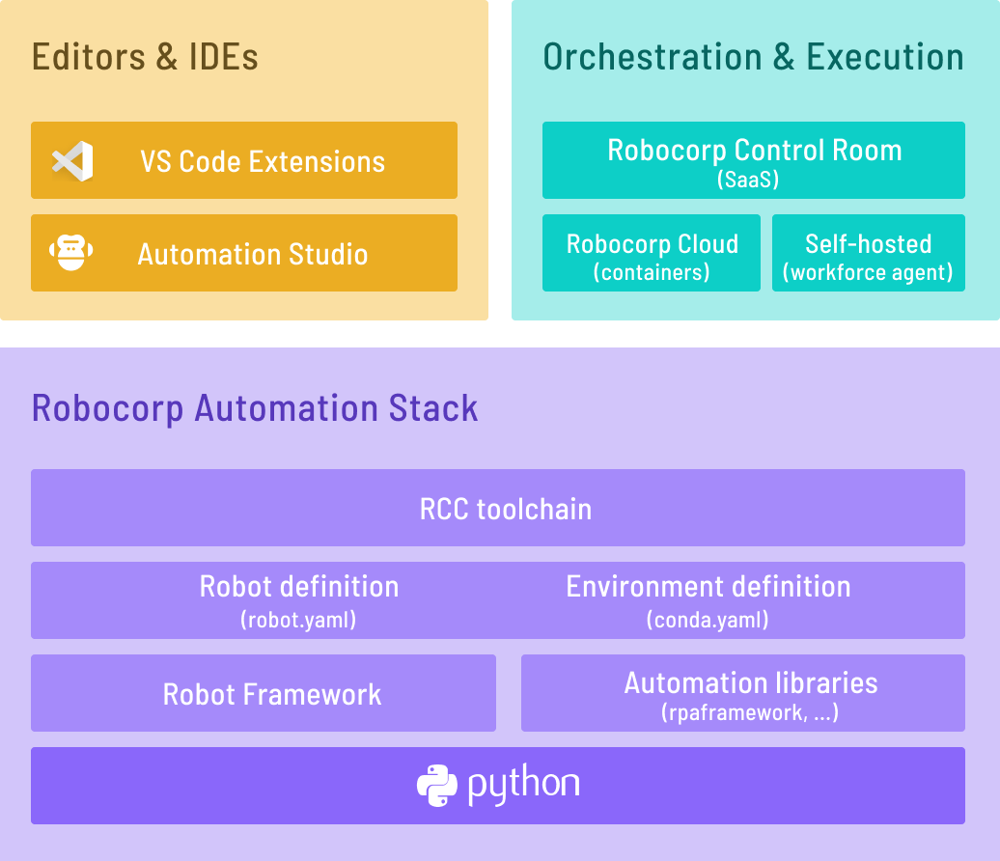

# License change notice

See [LICENSE-NOTICE.md](/LICENSE-NOTICE.md) for a notice on the terms
under which RCC is made available.

# Introduction

RCC allows you to create, manage, and distribute Python-based self-contained automation packages. RCC also allows you to run your automations in isolated Python environments so they can still access the rest of your machine.

🚀 "Repeatable, movable and isolated Python environments for your automation."

Together with [robot.yaml](https://sema4.ai/docs/automation/robot-structure/robot-yaml-format) configuration file, `rcc` is a foundation that allows anyone to build and share automation easily.

  

RCC is actively maintained by [Sema4.ai](https://sema4.ai/).

## Why use rcc?

* You do not need to install Python on the target machine
* You can control exactly which version of Python your automation will run on (..and which pip version is used to resolve dependencies)
* You can avoid `Works on my machine`
* No need for `venv`, `pyenv`, ... tooling and knowledge sharing inside your team.
* Define dependencies in `conda.yaml` and automation config in `robot.yaml` and let RCC do the heavy lifting.
* If you have run into "dependency drifts", where once working runtime environment dependencies get updated and break your production system?, RCC can freeze ALL dependencies, pre-build environments, and more.
* RCC will give you a heads-up if your automations have been leaving behind processes after running.

...and much much more.

👉 If the command line seems scary, just pick up [Seam4.ai -extension for VS Code](https://marketplace.visualstudio.com/items?itemName=sema4ai.sema4ai) -extension for VS Code, and you'll get the power of RCC directly in VS Code without worrying about the commands.

## Getting Started

:arrow_double_down: Install rcc
> [Installation guide](https://github.com/robocorp/rcc?tab=readme-ov-file#installing-rcc-from-the-command-line)

:octocat: Pull robot from GitHub:
> `rcc pull github.com/robocorp/template-python-browser`

:running: Run robot
> `rcc run`

:hatching_chick: Create your own robot from templates
> `rcc create`

For detailed instructions, visit [Robocorp RCC documentation](https://sema4.ai/docs/automation/rcc/overview) to get started.

## Installing RCC from the command line

> Links to changelog and different versions [available here](https://cdn.sema4.ai/rcc/releases/index.html)

### Windows

1. Open the command prompt
1. Download: `curl -o rcc.exe https://cdn.sema4.ai/rcc/releases/latest/windows64/rcc.exe`
1. [Add to system path](https://www.architectryan.com/2018/03/17/add-to-the-path-on-windows-10/): Open Start -> `Edit the system environment variables`
1. Test: `rcc`

### macOS

#### Brew cask from Robocorp tap

1. Update brew: `brew update`
1. Install: `brew install robocorp/tools/rcc`
1. Test: `rcc`

Upgrading: `brew upgrade rcc`

### Linux

1. Open the terminal
1. Download: `curl -o rcc https://cdn.sema4.ai/rcc/releases/latest/linux64/rcc`
1. Make the downloaded file executable: `chmod a+x rcc`
1. Add to path: `sudo mv rcc /usr/local/bin/`
1. Test: `rcc`

## Documentation

Visit [https://sema4.ai/docs/automation](https://sema4.ai/docs/automation) to view the full documentation on the full Robocorp stack.

The changelog can be seen [here](/docs/changelog.md). It is also visible inside RCC using the command `rcc docs changelog`.

Some tips, tricks, and recipes can be found [here](/docs/recipes.md).
These are also visible inside RCC using the command: `rcc docs recipes`.

## Community and Support

The Robocorp community can be found on [Developer Slack](https://robocorp-developers.slack.com), where you can ask questions, voice ideas, and share your projects.

## License

[Sema4.ai EULA](https://sema4.ai/cdn/downloads/legal/Sema4ai-EULA-v1.0.pdf)
