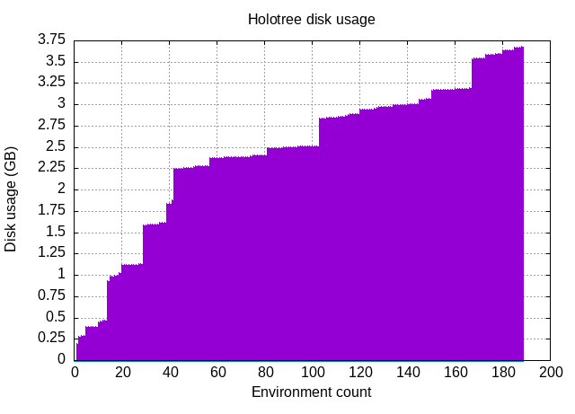
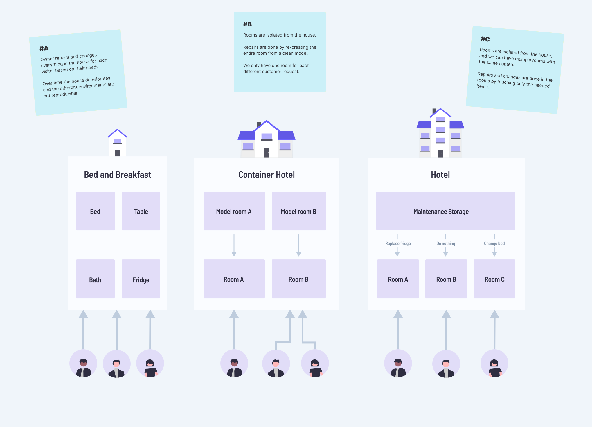

## What is execution environment isolation and caching?

Managing and isolating the execution environments is one of the biggest tasks and friction points that RCC is solving. The execution environment needs to have all the pieces in place for the robot to execute and that could mean a full setup Python environment, browsers, custom library packages, etc. In RPA solutions, "Work on my machine" just doesn't cut it.

*Credit: [xkcd.com](https://xkcd.com/1987/)*

The list of tools and techniques around just Python environment handling and package management is simply staggering:  
`pyenv, venv, pyenv-virtualenv, pip, pipenv, poetry, conda, ...`.   
Instead, how about just `rcc`?

RCC creates virtual execution environments that only show up as files and folders on the user machine, basically containing the complexity described above. The target is that neither setting up nor using these environments must either depend on or change anything to the user's environment.

The [hotel analogy below](/docs/environment-caching.md#a-better-analogy-accommodations) describes the problem and evolution of our solutions.

## The second evolution of environment management in RCC

The solution that goes by the working title `Holotree` is a big step up when it comes to efficiency, and it opens up a few significant doors for the future. The name for `Holotree` comes from the analogy to the [Holodeck in Star Trek](https://en.wikipedia.org/wiki/Holodeck). When things changed in the Holodeck, the "reload" only meant that, for example, a chair transformed into a table while the surroundings did not change.

Holotree is an environment cache that stores each unique file only once. When restoring an execution environment, it moves only the files that need to be moved or removed, reducing the disk usage and file I/O (input/output) actions. Fewer files to move and handle means fewer actions for the virus scanner in the local development setup, and in Robocorp Control Room, reduced CPU time. 

Holotree can fit hundreds of unique environments in a small space.

*Note: A single execution environment can span from 200MB to >1GB*

There are other significant changes and improvements in Holotree regarding [relocation](<https://en.wikipedia.org/wiki/Relocation_(computing)>) and [file locking](https://en.wikipedia.org/wiki/File_locking).

The implementation is already available in [RCC v10](https://github.com/robocorp/rcc/blob/master/docs/changelog.md), and we are rolling out it to our developer tools, applications and Control Room during Q3 2021.

### Relocation and file locking

Some binary files have the absolute path written into them when set up, which means the resulting file will only work in the same file structure where it was created.

To move or [relocate](<https://en.wikipedia.org/wiki/Relocation_(computing)>) the environment, one must either create the same file structure on the target machine or edit the binaries to contain the correct file paths. RCC with Holotree records the environment to the cache (a.k.a Hololib) with the original execution base folder for this problem. Thus, the execution will happen in the same structure but with a mechanism that enables relocation inside that base folder. This avoids file locks and isolates the executions. The mechanism has to do with hashing the execution folder name in the base folder.

[File locking](https://en.wikipedia.org/wiki/File_locking) affects mainly Windows but can affect macOS and Linux, too. Trying to change a file simultaneously in more than one process is usually harmful and requires individual files for different executors for the execution environments.

For example, when using Robocorp VS Code extensions on the same machine, it would be nice if the environment files do not get locked.

For this reason, RCC with Holotree provides a `space` -context so that each execution or client can choose a space where the execution happens. Furthermore, with the partial relocation support described above, the client's space is only made for and used by the clients' discretion, avoiding file collisions and giving control over disk space usage and file I/O to the client applications.

For example, a normal use case for Robocorp Assistant is that the end-user installs and uses five to ten assistants, and those change pretty rarely. Still, the execution should start pretty much immediately.

In this case, we would use RCC with Holotree to create a space for each assistant. This way, each assistant has the environment files ready to go with the cost of disk usage.

On the Workforce side, we could use just a single space as we cannot expect the execution to be similar, but they still share many files. For example, consecutive executions probably have well-over 90% of Python files remain the same, etc.

## A better analogy: accommodations

The evolution goes something like this:

"I invited you to my home." > "Welcome to a hotel built out of ship containers." > "Welcome to an actual Hotel."

The evolution of these steps is expanded in the following chapters.

### "I invited you to my home."

We start with a typical bed-and-breakfast where you set up your own house with kitchen, bathroom, bedroom with fridges, pieces of furniture, etc. Then, depending on the guest, your house is nice and clean after the visit, or the guests trash the place and hide a fish behind the radiator to surprise you a couple of days later. 🐟

In the robot dimension, this equates to running pip installs, setting up the correct version of Python and all the dependencies on the machine, executing the robot, and cleaning up all the files and changes made by the execution. A week later, you need to clear the entire pip cache due to some weird collision with another execution.

### "Welcome to a hotel built out of ship containers."

As engineers, we try to break a solution down into smaller pieces to mitigate the effects and reduce variables.

So, after the first guest trashed our house, we change our business model to withstand the occasional rock star or two. 😅

We buy shipping containers and deck them out with kitchens, bathrooms, and bedrooms. When we get a visitor, we ask what they want and see if we have a shipping container meeting the requirements or if we need to build a new one. In either case, we get a container for the guest and blob it in our "hotel". Now it does not matter how the guest behaves; after the visit, we can remove the container's content, and the next guest gets a new one. And more importantly, our own house is not damaged.

In the robot dimension, this is RCC's first environment cache implementation. It uses disk space to provide isolated environments, and if it detects any "pollution" in the environment, it replaces the entire content of the execution folder. The cache always stores the unique pristine version to avoid building from scratch every time. Effective, but not efficient.

### "Welcome to an actual Hotel."

After running our "Shipping container Hotel" for a while, we notice we are spending a whole lot of resources to replace the entire container even when the guest only ate a single chocolate bar from the mini-fridge. Also, people asking for different sizes of beds is driving you crazy!

How about running a regular hotel with some out-of-this-world properties? We still isolate guests to their rooms and protect ourselves from the rock stars, but instead of replacing the entire room every time something is broken or out of place, we send out a janitor and a cleanup crew.

We also notice that the pristine models of the containers take up a lot of space and have the same furniture. Hence, we decide to store the furniture models as single pieces in one warehouse together with the blueprints of the different room models we have. We also enable the guest to ask for the cleanup crew when making a more extended visit.

In the robot dimension, this means we have each file once on the Hololib side with the blueprints of the environments we have encountered.

Each hotel room in the analogy is a Holotree space, and we can load in different content to each space and keep them independent and free from file locking.

> When we encounter a new environment, we still need to use conda and pip stacks to build the new setup. Environment building will take anything between one to five minutes, depending on the disk and network speeds of the building machine.
